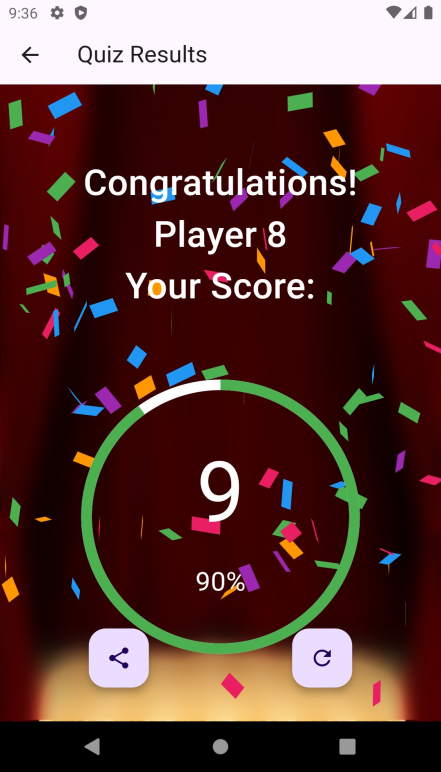

# QuizFlick 🎯

A Flutter-based quiz application that lets users test their knowledge across multiple subject categories with a countdown timer, animated results, and a clean modern UI.

---

## Table of Contents

- [Overview](#overview)
- [Features](#features)
- [Screenshots & App Flow](#screenshots--app-flow)
- [Project Structure](#project-structure)
- [Architecture](#architecture)
- [Question Categories & Data](#question-categories--data)
- [Dependencies](#dependencies)
- [Getting Started](#getting-started)
- [Building for Production](#building-for-production)
- [Known Limitations & Future Work](#known-limitations--future-work)

---

## Overview

**QuizFlick** is a mobile quiz app built with Flutter targeting Android and iOS. Users enter their name, pick a subject category, and answer 10 randomised multiple-choice questions — each with a 30-second countdown. At the end they receive an animated score card with confetti for high scorers.

| Property | Value |
|----------|-------|
| App name | QuizFlick |
| Package name | `com.example.flutter_quiz_app_project` |
| Version | 1.0.0+1 |
| Dart SDK | ≥ 3.4.1 < 4.0.0 |
| Flutter | ≥ 3.x (Material 3 compatible) |
| State management | GetX |

---

## Features

- **Animated splash screen** — logo scales from small to full size using `simple_animations`, then auto-navigates to the welcome screen.
- **User onboarding** — a slide-in card prompts the user to enter their name before proceeding.
- **Category selection** — an auto-playing `CarouselSlider` at the top plus a 2-column grid of image cards let users pick a quiz category.
- **Timed questions** — each question has a 30-second circular countdown timer. When time runs out the app auto-advances to the next question.
- **Randomised questions** — 10 questions are picked at random from the category pool and their answer options are shuffled on every session.
- **Instant answer feedback** — selected answers are highlighted green (correct) or red (wrong); the correct answer is always revealed after a selection.
- **Animated result screen** — score scales into view with an easing animation; confetti bursts fire automatically for scores ≥ 80%.
- **Light / Dark theme toggle** — accessible from the side navigation drawer; persists within the session.
- **Side navigation drawer** — includes links for Daily Quiz, Leaderboard, How To Use, About Us, Contact Us, and Terms & Conditions (UI placeholders).

---

## Screenshots & App Flow

```
SplashScreen
    └─▶ WelcomeScreen  (enter name)
            └─▶ CategoryScreen  (pick a subject)
                    └─▶ QuizScreen  (10 timed questions)
                            └─▶ ResultScreen  (score + confetti)
                                    └─▶ CategoryScreen  (play again)
```




---

## Project Structure

```
lib/
├── main.dart                        # App entry point, ThemeController init
│
├── models/
│   └── question.dart                # Question data model + JSON factory
│
├── controllers/                     # GetX controllers (business logic)
│   ├── data_controller.dart         # Shared state: category & username
│   ├── quiz_controller.dart         # Question loading, answer picking, scoring
│   ├── timer_controller.dart        # 30-second per-question countdown
│   ├── result_controller.dart       # Confetti + score animation controller
│   ├── theme_provider.dart          # Light/dark theme toggle
│   └── welcome_controller.dart      # Welcome screen username state
│
├── screens/
│   ├── splash_screen.dart           # Animated logo → auto-navigate
│   ├── welcome_screen_2.dart        # Name input onboarding card
│   ├── category_screen_2.dart       # Carousel + grid category picker
│   ├── quiz_screen_2.dart           # Question display + timer UI
│   ├── result_screen_2.dart         # Animated score + confetti
│   └── sidenavbar.dart              # Drawer navigation + theme toggle
│
└── widgets/
    ├── answer_card.dart             # Answer option card with feedback colours
    └── next_button.dart             # Reusable "Next / Finish" button

assets/
├── QuizFlick_logo.png
├── QuizFlick_logo_img.png           # Used as launcher icon
├── QuizFlick_splash_img.png         # Splash animation image
├── welcome_img.png
├── background.png
├── quiz_screen.jpg                  # Background for quiz screen
├── result_image.png                 # Background for result screen
│
├── gk_img-min.png                   # General Knowledge card image
├── science_img.png
├── history_img-min.png
├── geography_img-min.png
├── computer_img-min.png
├── Neet_img.jpg                     # NEET (coming soon placeholder)
│
├── questions.json                   # 48 General Knowledge questions
├── science_questions.json           # 51 Science questions
├── history_questions.json           # 45 History questions
├── geography_questions.json         # 45 Geography questions
└── computer_questions.json          # 61 Computer Science questions
```

---

## Architecture

The app follows the **GetX MVC pattern**:

- **Models** hold pure data (`Question`).
- **Controllers** hold all business logic and reactive state. They are registered with `Get.put()` and retrieved with `Get.find()`.
- **Screens / Widgets** are stateless wherever possible; they observe reactive variables through `Obx()` or `GetBuilder`.

### Controller Responsibilities

| Controller | Responsibility |
|---|---|
| `ThemeController` | Tracks and toggles light/dark `ThemeMode` |
| `DataController` | Stores the active `category` and `userName` across screens |
| `WelcomeController` | Local username state on the welcome screen |
| `QuizController` | Loads questions from JSON, shuffles them, tracks `questionIndex`, `selectedAnswerIndex`, and `score` |
| `TimerController` | 30 s countdown per question; auto-advances on timeout; navigates to results on last question timeout |
| `ResultController` | Drives the scale-in animation and fires confetti when score ≥ 80 % |

### Question Lifecycle

```
JSON asset ──▶ QuizController.loadQuestions()
                  ├─ decode JSON → List<Question>
                  ├─ shuffle list, take first 10
                  └─ shuffle answer options (keeping correctAnswerIndex in sync)
                              │
                      QuizScreen displays questions one by one
                              │
                      TimerController counts down 30 s per question
                              │
                      ResultScreen shows score + percentage
```

---

## Question Categories & Data

Questions are stored as local JSON files in `assets/`. Each entry follows this schema:

```json
{
  "question": "What is the capital of France?",
  "options": ["Madrid", "Paris", "Berlin", "Rome"],
  "correctAnswerIndex": 1
}
```

> **Note:** `correctAnswerIndex` in the JSON refers to the original position. The app re-shuffles the options array and recomputes the index at runtime, so there is no risk of the answer always appearing in the same position.

| Category | File | Questions |
|---|---|---|
| General Knowledge | `questions.json` | 48 |
| Science | `science_questions.json` | 51 |
| History | `history_questions.json` | 45 |
| Geography | `geography_questions.json` | 45 |
| Computer Science | `computer_questions.json` | 61 |
| NEET | *(coming soon — disabled in UI)* | — |

---

## Dependencies

```yaml
dependencies:
  get: 4.6.6                  # State management & navigation
  carousel_slider: 4.2.1      # Category carousel on home screen
  cupertino_icons: ^1.0.6     # iOS-style icons
  simple_animations: ^5.0.2   # Splash screen logo animation
  confetti: ^0.7.0            # Confetti on high scores

dev_dependencies:
  flutter_launcher_icons: ^0.13.1   # Generates launcher icons from asset
  flutter_lints: ^4.0.0
```

> `audioplayers` is present in the pubspec but commented out — sound effects are not yet implemented.

---

## Getting Started

### Prerequisites

- Flutter SDK **3.x or later** (`flutter --version` to verify)
- Dart SDK **≥ 3.4.1**
- Android Studio / Xcode for device deployment

### Installation

```bash
# 1. Clone or extract the project
cd flutter_quiz_app_project

# 2. Install dependencies
flutter pub get

# 3. Generate launcher icons (optional, already generated)
dart run flutter_launcher_icons

# 4. Run on a connected device or emulator
flutter run
```

### Running on a Specific Platform

```bash
flutter run -d android      # Android device / emulator
flutter run -d ios          # iOS device / simulator (macOS only)
flutter run -d chrome       # Web (experimental)
```

---

## Building for Production

```bash
# Android APK
flutter build apk --release

# Android App Bundle (recommended for Play Store)
flutter build appbundle --release

# iOS (macOS + Xcode required)
flutter build ios --release
```

Output files are placed in `build/app/outputs/` (Android) or `build/ios/` (iOS).

---

## Known Limitations & Future Work

The following features are visible in the UI but are not yet functional:

- **NEET category** — shown in the carousel and grid with a "coming soon" label; tapping it does nothing.
- **Bottom navigation bar** — Home, Search, Favorites, and Profile tabs are rendered but navigation between them is not implemented.
- **Side drawer links** — Daily Quiz, Leaderboard, How To Use, About Us, Contact Us, and Terms & Conditions items have empty `onTap` handlers.
- **Notifications / Settings icons** — present in the AppBar but not wired up.
- **Share button on result screen** — the FAB is rendered but the share action is not implemented.
- **Leaderboard** — the drawer shows a hardcoded "999th Rank" placeholder.
- **Coin system** — the drawer shows "0 coins"; no backend or logic exists yet.
- **Sound effects** — `audioplayers` dependency is commented out; no audio plays.
- **Score persistence** — scores are not saved between sessions; restarting the app resets everything.

**Suggested next steps:**

1. Implement `share_plus` for the result share button.
2. Add `shared_preferences` or a lightweight local DB (e.g. `hive`) for score history and streak tracking.
3. Wire up the remaining bottom navigation tabs with actual screens.
4. Add the NEET question bank and remove the "coming soon" guard.
5. Introduce sound effects using `audioplayers` for correct/wrong answers and countdown warnings.
